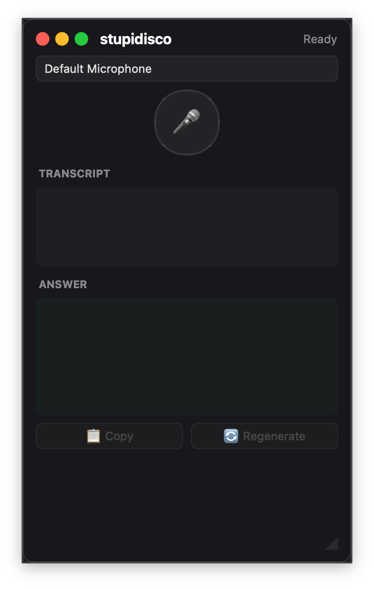

# stupidisco

<p align="center">
  
</p>

<p align="center">
  <a href="#-deutsch">
    
  </a>
  &nbsp;
  <a href="#-english">
    
  </a>
</p>

---

##  Deutsch

Echtzeit-Interview-Assistent als Overlay für macOS, Windows und Linux. Erfasst gesprochene Fragen aus Videocalls (Google Meet, Teams, Zoom) per Mikrofon, transkribiert sie live und generiert kompakte deutsche Antworten — angezeigt in einem kleinen Always-on-Top-Overlay-Fenster.

### Features

| Feature | Beschreibung |
|---------|-------------|
| **Live-Transkription** | Deepgram Streaming-STT (nova-3 Modell, Deutsch) |
| **KI-Antworten** | Claude generiert prägnante Antworten in 2–3 Sätzen, in Echtzeit gestreamt |
| **Always-on-Top-Overlay** | Dunkles rahmenloses Fenster, verschieb- und größenveränderbar |
| **Fenstersteuerung** | macOS-Style Traffic-Light-Buttons (Schließen, Minimieren, Maximieren) |
| **Hotkey** | `Cmd+Shift+R` (macOS) / `Ctrl+Shift+R` (Windows/Linux) |
| **Geräteauswahl** | Mikrofon per Dropdown wählbar |
| **Kopieren & Regenerieren** | Antwort in die Zwischenablage kopieren oder neu generieren |
| **API-Key-Dialog** | Keys werden beim ersten Start abgefragt und in `~/.stupidisco/.env` gespeichert |
| **Session-Logging** | Frage-Antwort-Paare in `~/.stupidisco/sessions/` |

### Download

Fertige Binaries für alle Plattformen:

| Plattform | Architektur | Format |
|-----------|------------|--------|
| macOS | arm64 (Apple Silicon) | `.app` im ZIP |
| Windows | x64 | `.exe` im ZIP |
| Linux | x64 | Binary im tar.gz |

Zur [**Releases-Seite**](https://github.com/pepperonas/stupidisco/releases)

### Voraussetzungen

- Python 3.10+
- [Deepgram API-Key](https://console.deepgram.com/) — kostenlose Stufe mit $200 Guthaben
- [Anthropic API-Key](https://console.anthropic.com/)

### Installation

```bash
git clone https://github.com/pepperonas/stupidisco.git
cd stupidisco
python3 -m venv venv && source venv/bin/activate
pip install -r requirements.txt
```

### Nutzung

```bash
python stupidisco.py
```

1. Mikrofon aus dem Dropdown wählen (oder Standard verwenden)
2. Mic-Button klicken oder Hotkey drücken — Aufnahme startet
3. Frage sprechen
4. Erneut klicken/Hotkey — Antwort streamt innerhalb von Sekunden
5. **Kopieren** oder **Regenerieren**

> **Tipp:** Headset-Mikrofon verwenden, um Echo zu reduzieren.

> **macOS:** Beim ersten Start Mikrofonberechtigung erteilen.

### Funktionsweise

```
          ┌────────────┐
          │  Mikrofon   │
          │  (16kHz)    │
          └──────┬─────┘
                 │ Audio-Chunks
                 v
          ┌────────────┐
          │  Deepgram   │
          │  nova-3 STT │
          └──────┬─────┘
                 │ Transkript
                 v
          ┌────────────┐
          │  Claude AI  │
          │  Streaming  │
          └──────┬─────┘
                 │ Antwort (Token für Token)
                 v
     ┌───────────────────────┐
     │  PyQt6 Overlay (AOT)  │
     │  Transkript + Antwort │
     └───────────────────────┘
```

### Konfiguration

API-Keys werden beim ersten Start per Dialog abgefragt. Alternativ `.env` im Projektverzeichnis:

```bash
DEEPGRAM_API_KEY=dein_key
ANTHROPIC_API_KEY=dein_key
```

Weitere Konstanten in `stupidisco.py`:

| Konstante | Standard | Beschreibung |
|-----------|---------|-------------|
| `CLAUDE_MODEL` | `claude-3-5-haiku-20241022` | Claude-Modell für Antworten |
| `SYSTEM_PROMPT` | *(inline)* | Anweisungen für die Antwortgenerierung |
| `SAMPLE_RATE` | `16000` | Audio-Abtastrate in Hz |
| `CHUNK_MS` | `100` | Audio-Chunk-Größe in Millisekunden |

---

##  English

Real-time interview assistant overlay for macOS, Windows and Linux. Captures spoken questions from video calls (Google Meet, Teams, Zoom) via microphone, transcribes them live and generates compact German answers — displayed in a small always-on-top overlay window.

### Features

| Feature | Description |
|---------|-------------|
| **Live transcription** | Deepgram streaming STT (nova-3 model, German) |
| **AI answers** | Claude generates concise answers in 2–3 sentences, streamed in real-time |
| **Always-on-top overlay** | Dark frameless window, draggable and resizable |
| **Window controls** | macOS-style traffic light buttons (close, minimize, maximize) |
| **Hotkey** | `Cmd+Shift+R` (macOS) / `Ctrl+Shift+R` (Windows/Linux) |
| **Device selection** | Any connected microphone selectable via dropdown |
| **Copy & Regenerate** | Copy answer to clipboard or re-generate |
| **API key dialog** | Prompts for keys on first launch, saves to `~/.stupidisco/.env` |
| **Session logging** | Q&A pairs saved to `~/.stupidisco/sessions/` |

### Download

Pre-built binaries for all platforms:

| Platform | Architecture | Format |
|----------|-------------|--------|
| macOS | arm64 (Apple Silicon) | `.app` in ZIP |
| Windows | x64 | `.exe` in ZIP |
| Linux | x64 | Binary in tar.gz |

Go to [**Releases**](https://github.com/pepperonas/stupidisco/releases)

### Requirements

- Python 3.10+
- [Deepgram API key](https://console.deepgram.com/) — free tier with $200 credit
- [Anthropic API key](https://console.anthropic.com/)

### Installation

```bash
git clone https://github.com/pepperonas/stupidisco.git
cd stupidisco
python3 -m venv venv && source venv/bin/activate
pip install -r requirements.txt
```

### Usage

```bash
python stupidisco.py
```

1. Select microphone from dropdown (or use default)
2. Click mic button or press hotkey — recording starts
3. Speak your question
4. Click again / hotkey — answer streams within seconds
5. **Copy** or **Regenerate**

> **Tip:** Use a headset microphone to reduce echo from speakers.

> **macOS:** Grant microphone permission when prompted on first launch.

### How it works

```
          ┌────────────┐
          │ Microphone  │
          │  (16kHz)    │
          └──────┬─────┘
                 │ Audio chunks
                 v
          ┌────────────┐
          │  Deepgram   │
          │  nova-3 STT │
          └──────┬─────┘
                 │ Transcript
                 v
          ┌────────────┐
          │  Claude AI  │
          │  Streaming  │
          └──────┬─────┘
                 │ Answer (token by token)
                 v
     ┌───────────────────────┐
     │  PyQt6 Overlay (AOT)  │
     │ Transcript + Answer   │
     └───────────────────────┘
```

### Configuration

API keys are prompted on first launch via dialog. Alternatively, create `.env` in the project directory:

```bash
DEEPGRAM_API_KEY=your_key
ANTHROPIC_API_KEY=your_key
```

Additional constants in `stupidisco.py`:

| Constant | Default | Description |
|----------|---------|-------------|
| `CLAUDE_MODEL` | `claude-3-5-haiku-20241022` | Claude model for answers |
| `SYSTEM_PROMPT` | *(inline)* | Instructions for answer generation |
| `SAMPLE_RATE` | `16000` | Audio sample rate in Hz |
| `CHUNK_MS` | `100` | Audio chunk size in milliseconds |

---

## Architecture

<table>
<tr><td>

**Threading Model**

```
Main Thread (Qt)
  ├── GUI rendering
  ├── Signal/Slot dispatch
  └── Hotkey listener
       └── NSEvent (macOS)
       └── pynput (Win/Linux)

Recording Thread
  ├── Deepgram WS connect
  ├── sounddevice callback
  │   └── send_media()
  └── Listener Thread
       └── start_listening()

Async Worker (QThread)
  └── asyncio event loop
       └── Claude streaming
```

</td><td>

**Tech Stack**

| Component | Technology |
|-----------|-----------|
| GUI | PyQt6 |
| STT | Deepgram SDK v5 (nova-3) |
| AI | Anthropic Claude (haiku) |
| Audio | sounddevice / PortAudio |
| Hotkey | NSEvent / pynput |
| Config | python-dotenv |
| Build | PyInstaller |
| CI/CD | GitHub Actions |

</td></tr>
</table>

### Target Latency / Ziel-Latenz

< 2–3 seconds from stop click to full answer display.

## Developer

**Martin Pfeffer** — [celox.io](https://celox.io)

## License / Lizenz

MIT

---

## Why "stupidisco"? / Warum "stupidisco"?

> **stupidisco** — from Italian *stupire* (to astonish). *"Stupidisco"* is the first person singular: **"I astonish"**, **"I amaze"**, **"I astound"**.
>
> **stupidisco** — aus dem Italienischen *stupire* (erstaunen). *„Stupidisco"* ist die erste Person Singular: **„ich überrasche"**, **„ich erstaune"**, **„ich verblüffe"**.

Also inspired by [Stupidisco](https://www.youtube.com/watch?v=GJfydUI2Hzs&list=RDGJfydUI2Hzs&start_radio=1) by Junior Jack.

<p align="center">
  <a href="https://www.youtube.com/watch?v=GJfydUI2Hzs&list=RDGJfydUI2Hzs&start_radio=1">
    
  </a>
</p>
